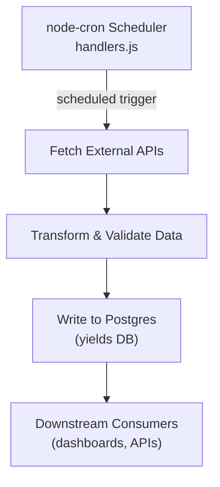

# Data Ingestion System – One-Pager

## 1. Execution Flow (High-Level)
1. **Scheduler** – `node-cron` runs at the configured interval and invokes:
   ```bash
   node /app/src/scripts/handlers.js
   ```
2. **Handler Bootstrap** – `handlers.js` imports/initialises individual data-source handlers.
3. **Data Fetch** – Each handler issues HTTP/RPC calls to external providers to pull raw yield data.
4. **Transform & Validate** – Responses are normalised, enriched, and validated (e.g., schema checks, unit conversions).
5. **Persistence** – Transformed records are written (insert/upsert) into the **Postgres** database named **`yields`**.
6. **Completion** – Cron exits; next run repeats the cycle.

## 2. Data Destination
* Database: **Postgres**  
* DB Name: **`yields`**  
* Typical tables: `protocol_yields`, `asset_prices`, `runs` (exact names may vary).

## 3. Fetch Frequency
* Controlled by `node-cron` schedule string inside `handlers.js` (`* * * * *` ⇒ every **minute**).  
* Adjusting the cron expression changes system cadence without code changes elsewhere.

## 4. Inefficiencies / Needs Improvement
* Sequential API calls – no batching or concurrency limits throughput.
* No caching – identical data fetched repeatedly within short windows.
* Lack of retry/back-off – transient failures cause missing datapoints.
* Writes are one-row-at-a-time – bulk-insert could cut DB latency.
* No monitoring/metrics – hard to detect slowdowns or failures in real-time.

## 5. Current Limitations
* **Single-threaded** – one cron worker; horizontal scaling requires manual orchestration.
* **Hard-coded schedule** – deploy needed for cadence change.
* **Resource contention** – long API responses can overlap next cron run.
* **Error visibility** – logs only; no alerting/notification pipeline.
* **Data correctness lag** – if a run fails, gap persists until next successful cycle.

## 6. System Flowchart
